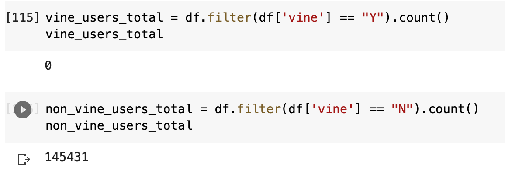

# Amazon Vine Analysis
This analysis aims to determine which reviews are often most helpful and whether the customers' status as a vine customer contributes to star rating and level of helpfulness. The dataset includes reviews of digital video games. 

## Results 

- All of the reviews in this dataset were non-vine reviews. 
- As there were no vine reviews, all of the five-star reviews came from non-vine users. 
- The dataset cannot determine whether the user's status as a vine user makes a difference because it does not include vine users. 

## Summary 
Based on the dataset, we will need to collect digital video game reviews from vine users specifically, perhaps through targeted requests for feedback via emails, text messages, or popups. Once we collect a sufficient amount of reviews from vine users, we will be able to rerun our analysis to see if there's a discrepancy. Additionally, we could perform a sentiment analysis 

